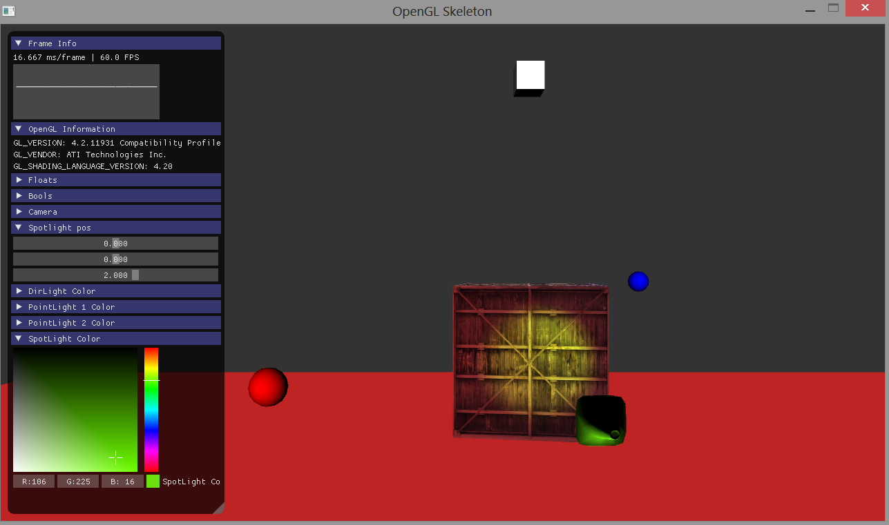

OpenGL Skeleton 
===

A no-fuss skeleton for creating OpenGL applications with SDL2, GLAD, GLM, ASSIMP, STB and Imgui.

1) Clone repo and submodules
```
git clone --recursive --progress -v "https://github.com/zach2good/opengl-skeleton.git"
```
2) Point CMake at it<br>
3) ???<br>
4) Profit<br>
<br>
<br>

Desktop
===
<br>

Web
===
<br>
