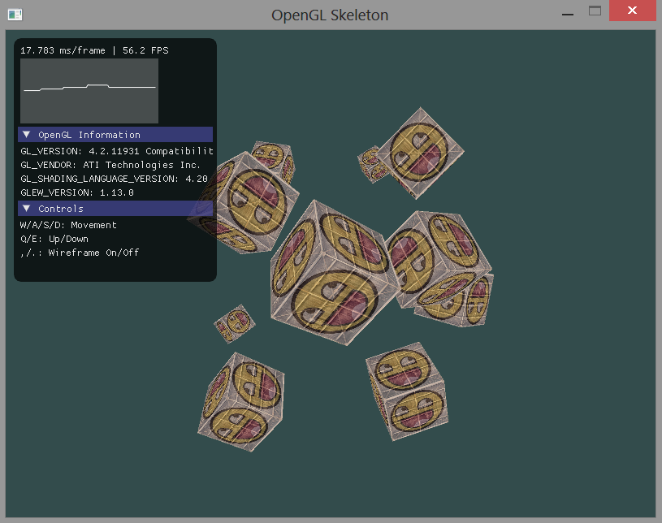
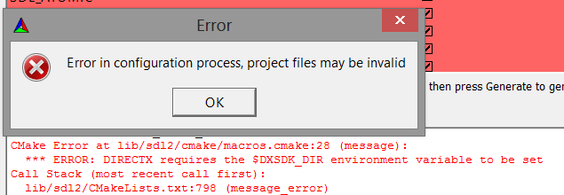
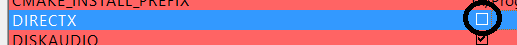

OpenGL Skeleton 
===

A no-fuss skeleton app for creating OpenGL applications with SDL2, GLEW, GLM, stb_image and Imgui. All sources included. 

<b>Just point CMake at it and generate your project files</b>.

TODO
===
* Work through basic examples in books and online to build functionality
* Make robust basic functionality (Default shaders, test scene, OBJ Loader etc.)

Troubleshooting
===

When doing your CMake build if you are faced with this error: 

Click through it and <b>untick "DirectX"</b>. 

You will then be able to continue your build. 
